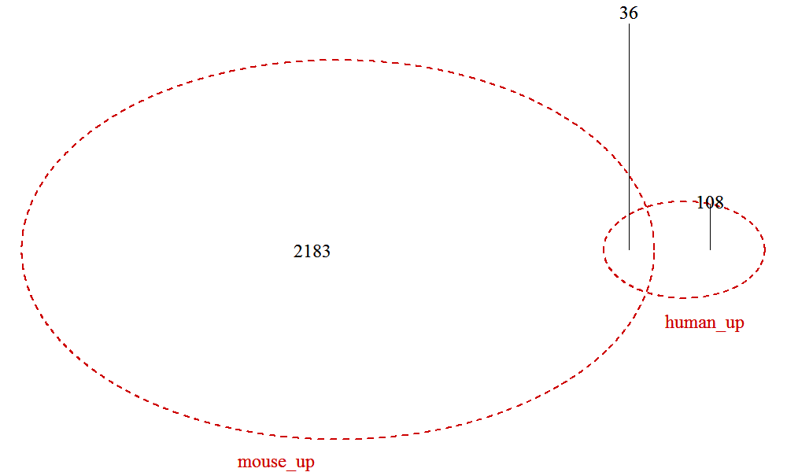
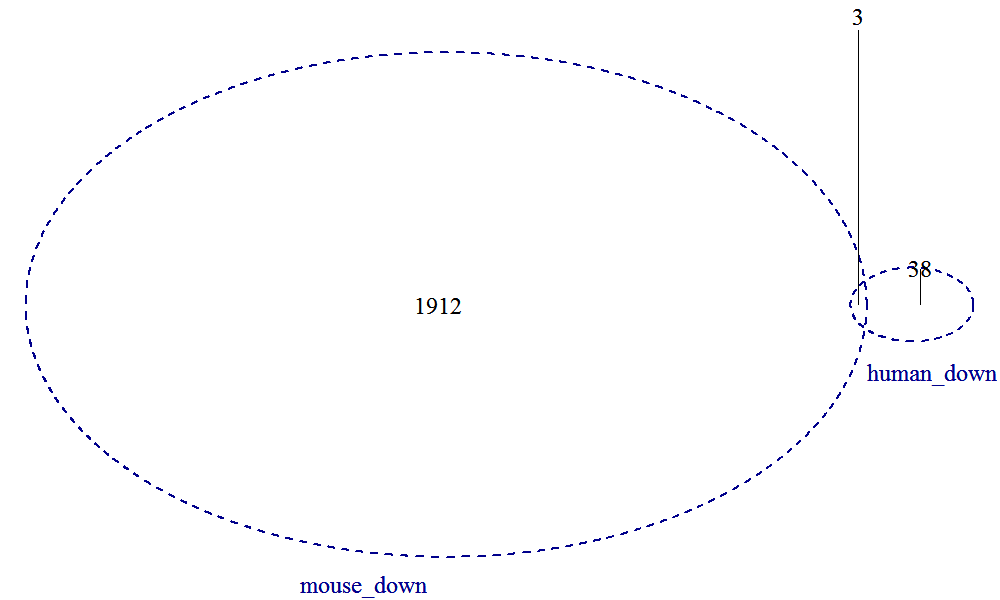

```{r global_options, warning=FALSE, message=FALSE}
library(ggplot2)
library(pheatmap)
library(tidyverse)
library(dplyr)
library(org.Mm.eg.db)
library(org.Hs.eg.db)
library(GO.db)
library(clusterProfiler)
library(enrichplot)
library(fgsea)
library(DOSE)
library(RcisTarget)
library(DT)
library(reshape2)
library(visNetwork)
library(biomaRt)
library(VennDiagram)
```

```{r}
# loading data
mouse_all_genes = read.table("6_mouse_samples/DEGs/mouse_13.VS.mouse_14.all.table", header=T, row.names = 1)
mouse_degs = read.table("6_mouse_samples/DEGs/mouse_13.VS.mouse_14.DEGs.table", header=T, row.names = 1)

human_all_genes = read.table("6_human_samples/DEGs/human_15.VS.human_16.all.table", header=T, row.names = 1)
human_degs = read.table("6_human_samples/DEGs/human_15.VS.human_16.DEGs.table", header=T, row.names = 1)

mouse_all_genes = transform(mouse_all_genes, gene_id=as.character(gene_id))
mouse_all_genes = transform(mouse_all_genes, gene=as.character(gene))
mouse_all_genes = data.frame(mouse_all_genes)

human_all_genes = transform(human_all_genes, gene_id=as.character(gene_id))
human_all_genes = transform(human_all_genes, gene=as.character(gene))
human_all_genes = data.frame(human_all_genes)

mouse_degs = transform(mouse_degs, gene_id=as.character(gene_id))
mouse_degs = transform(mouse_degs, gene=as.character(gene))
mouse_degs = data.frame(mouse_degs)

human_degs = transform(human_degs, gene_id=as.character(gene_id))
human_degs = transform(human_degs, gene=as.character(gene))
human_degs = data.frame(human_degs)

mouse_fpkm = read.table("6_mouse_samples/gene.FPKM.filtered.table", header=T, row.names = 1)
colnames(mouse_fpkm) = c("mouse_CAG_low_13_1","mouse_CAG_low_13_2","mouse_CAG_low_13_3","mouse_CAG_hi_14_1","mouse_CAG_hi_14_2","mouse_CAG_hi_14_3")

human_fpkm = read.table("6_human_samples/gene.FPKM.filtered.table", header=T, row.names = 1)
colnames(human_fpkm) = c("human_CAG_low_15_1","human_CAG_low_15_2","human_CAG_low_15_3","human_CAG_hi_16_1","human_CAG_hi_16_2","human_CAG_hi_16_3")
```

```{r}
mart1 = biomaRt::useMart("ensembl", dataset="hsapiens_gene_ensembl")
mart2 = biomaRt::useMart("ensembl", dataset="mmusculus_gene_ensembl") 

# human_ids <- c('ENSG00000109339', 'ENSG00000129990', 
#                'ENSG00000132854', 'ENSG00000148204')

human_up <- human_degs[human_degs$regulation == "up",]$gene_id
human_up_2_mouse <- biomaRt::getLDS(attributes=c("ensembl_gene_id"),
                                    filters="ensembl_gene_id", 
                                    values=human_up, mart=mart1,
                                    attributesL=c("ensembl_gene_id"),
                                    martL=mart2)
colnames(human_up_2_mouse) <- c("human_ID","mouse_ID")

human_down <- human_degs[human_degs$regulation == "down",]$gene_id
human_down_2_mouse <- biomaRt::getLDS(attributes=c("ensembl_gene_id"),
                                      filters="ensembl_gene_id", 
                                      values=human_down, mart=mart1,
                                      attributesL=c("ensembl_gene_id"), 
                                      martL=mart2)
colnames(human_down_2_mouse) <- c("human_ID","mouse_ID")

mouse_up <- mouse_degs[mouse_degs$regulation == "up",]$gene_id
mouse_down <- mouse_degs[mouse_degs$regulation == "down",]$gene_id
```

## Overlap of up-regulated DEGs in mouse and human CAG hi
```{r warning=FALSE, message=FALSE}
png(filename = "overlap_of_human_up_and_mouse_up.png",width = 1000, height = 600)
venn.plot <- draw.pairwise.venn(
  area1=length(human_up),
  area2=length(mouse_up),
  cross.area=length(intersect(human_up_2_mouse$mouse_ID,mouse_up)),
  category=c('human_up','mouse_up'),
  lwd=rep(2,2),lty=rep(2,2),cex = rep(2, 3),
  col=c('red3','red3'),
  # fill=c('red3','orangered1'),
  cat.col=c('red3','red3'),
  cat.cex = rep(2, 2),
  filename="overlap_of_human_up_and_mouse_up.png",
  imagetype="png",
  resolution =600,
  cat.pos = c(-10, 10),
  cat.default.pos = 'outer')
grid.draw(venn.plot)
invisible(dev.off())

```

### Heatmap of the 36 overlaps (human gene names are converted to mouse gene names)
```{r warning=FALSE, message = FALSE, fig.width=10, fig.height=10}
overlaps = intersect(human_up_2_mouse$mouse_ID,mouse_up)
overlaps_mouse_fpkm = mouse_fpkm[overlaps,]
row.names(overlaps_mouse_fpkm) = mouse_all_genes[mouse_all_genes$gene_id %in% overlaps,]$gene

overlaps_ID_in_human = human_up_2_mouse[human_up_2_mouse$mouse_ID %in% overlaps,]$human_ID
overlaps_human_fpkm = human_fpkm[overlaps_ID_in_human,]
row.names(overlaps_human_fpkm) = mouse_all_genes[human_up_2_mouse[human_up_2_mouse$human_ID %in% overlaps_ID_in_human,]$mouse_ID,]$gene

merge_human_and_mouse = merge(overlaps_mouse_fpkm, overlaps_human_fpkm, by = "row.names")
row.names(merge_human_and_mouse) = merge_human_and_mouse$Row.names
merge_human_and_mouse$Row.names <- NULL

pheatmap(log10(merge_human_and_mouse+1),
         cluster_rows=T,
         cluster_cols=F,
         show_rownames=T,
         show_colnames=T,
         fontsize_row=10,
         fontsize_col=12)
```


## Overlap of down-regulated DEGs in mouse and human CAG hi
```{r warning=FALSE, message=FALSE}
png(filename = "overlap_of_human_down_and_mouse_down.png",width = 1000, height = 600)
venn.plot <- draw.pairwise.venn(
  area1=length(human_down),
  area2=length(mouse_down),
  cross.area=length(intersect(human_down_2_mouse$mouse_ID,mouse_down)),
  category=c('human_down','mouse_down'),
  lwd=rep(2,2),lty=rep(2,2),cex = rep(2, 3),
  col=c('blue4','blue4'),
  # fill=c('red3','orangered1'),
  cat.col=c('blue4','blue4'),
  cat.cex = rep(2, 2),
  filename="overlap_of_human_down_and_mouse_down.png",
  imagetype="png",
  resolution =600,
  cat.pos = c(-10, 10),
  cat.default.pos = 'outer')
grid.draw(venn.plot)
invisible(dev.off())

```

### Heatmap of the 3 overlaps
```{r warning=FALSE, message = FALSE}
overlaps = intersect(human_down_2_mouse$mouse_ID,mouse_down)
overlaps_mouse_fpkm = mouse_fpkm[overlaps,]
row.names(overlaps_mouse_fpkm) = mouse_all_genes[mouse_all_genes$gene_id %in% overlaps,]$gene

overlaps_ID_in_human = human_down_2_mouse[human_down_2_mouse$mouse_ID %in% overlaps,]$human_ID
overlaps_human_fpkm = human_fpkm[overlaps_ID_in_human,]
row.names(overlaps_human_fpkm) = mouse_all_genes[human_down_2_mouse[human_down_2_mouse$human_ID %in% overlaps_ID_in_human,]$mouse_ID,]$gene

merge_human_and_mouse = merge(overlaps_mouse_fpkm, overlaps_human_fpkm, by = "row.names")
row.names(merge_human_and_mouse) = merge_human_and_mouse$Row.names
merge_human_and_mouse$Row.names <- NULL

pheatmap(log10(merge_human_and_mouse+1),
         cluster_rows=T,
         cluster_cols=F,
         show_rownames=T,
         show_colnames=T,
         fontsize_row=10,
         fontsize_col=12)
```
