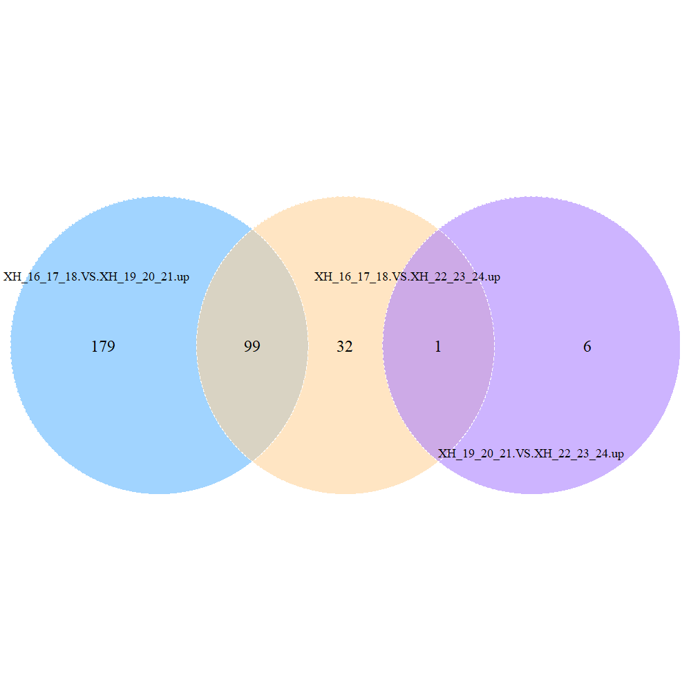
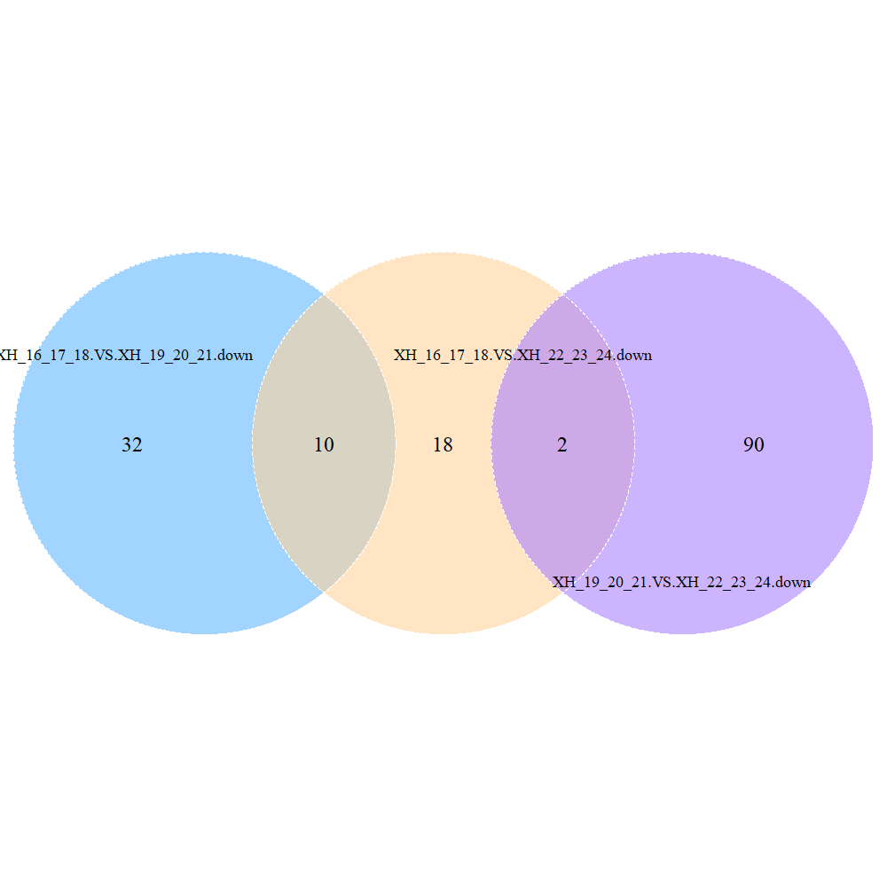

Experiment (9 Mouse samples):

group A: Sample_XH_1916, Sample_XH_1917, Sample_XH_1918 

group B: Sample_XH_1919, Sample_XH_1920, Sample_XH_1921 

group C: Sample_XH_1922, Sample_XH_1922, Sample_XH_1922 


Using *Tophat2* and *Cuffdiff* to do reads mapping, gene quantification and DEGs identification. Run the scripts in Yale linux server.

`perl 1.run.tophat2.parallel.pl /home/zj76/project/Xiao_Sun2_ad2/Sample_XH_1916_to_Sample_XH_1924`

`perl 2.run.cuffdiff.with.slurm.pl /home/zj76/project/database/mm10/Mus_musculus.GRCm38.96.gtf XH_19_16_17_18,XH_19_19_20_21,XH_19_22_23_24`

`sbatch cuffdiff.sh.run.slurm.sh`

`perl 3.mapping.sta.pl`

`perl 4.HTSeq.counts.table.pl`;`perl 4.FPKM.table.from.cuffnorm.pl`

`perl 5.FPKM.fiter.pl`

`perl 6.FPKM.sta.pl gene.FPKM.filtered.table`

`perl 7.DEGs.from.cuffdiff.pl`

```{r global_options, warning=FALSE, message=FALSE}
library(ggplot2)
library(pheatmap)
library(tidyverse)
library(dplyr)
library(org.Mm.eg.db)
library(org.Hs.eg.db)
library(GO.db)
library(clusterProfiler)
library(enrichplot)
library(fgsea)
library(DOSE)
library(RcisTarget)
library(DT)
library(reshape2)
library(visNetwork)
library(biomaRt)
library(VennDiagram)
```

## Mapping statistics
```{r}
mapping = read.table("mapping.sta.table",header=T, row.names = 1)
mapping
```

## Samples correlation
```{r}
fpkm = read.table("gene.FPKM.filtered.table", header=T, row.names = 1)
b=cor(fpkm,method="spearman") #method = c("pearson", "kendall", "spearman")
pheatmap(b)
```

## Differential expressed genes (DEGs)
XH_16_17_18.VS.XH_19_20_21      up: 278; down: 42

XH_16_17_18.VS.XH_22_23_24      up: 132; down: 30

XH_19_20_21.VS.XH_22_23_24      up: 7;   down: 92

### XH_16_17_18.VS.XH_19_20_21
```{r}
a_vs_b_degs = read.table("DEGs/XH_16_17_18.VS.XH_19_20_21.DEGs.table", header=T, row.names = 1)
datatable(a_vs_b_degs,filter="top")
```

### XH_16_17_18.VS.XH_22_23_24
```{r}
a_vs_c_degs = read.table("DEGs/XH_16_17_18.VS.XH_22_23_24.DEGs.table", header=T, row.names = 1)
datatable(a_vs_c_degs,filter="top")
```

### XH_19_20_21.VS.XH_22_23_24
```{r}
b_vs_c_degs = read.table("DEGs/XH_19_20_21.VS.XH_22_23_24.DEGs.table", header=T, row.names = 1)
datatable(b_vs_c_degs,filter="top")
```

### Overlap of up-regulated DEGs
```{r warning=FALSE, message=FALSE}
png(filename = "overlap_of_up.png",width = 1000, height = 1000)
venn.plot <- venn.diagram(
  x=list(A=a_vs_b_degs[a_vs_b_degs$regulation == "up",]$gene,
         B=a_vs_c_degs[a_vs_c_degs$regulation == "up",]$gene,
         C=b_vs_c_degs[b_vs_c_degs$regulation == "up",]$gene),
  #filename="overlap_of_up.png",
  filename=NULL,
  #height = 3000, width = 3000,
  resolution =600,
  imagetype="png",
  category.names=c("XH_16_17_18.VS.XH_19_20_21.up","XH_16_17_18.VS.XH_22_23_24.up","XH_19_20_21.VS.XH_22_23_24.up"),
  col="white", 
  fill=c(colors()[616], colors()[38], colors()[468]), 
  alpha=rep(0.6,3), 
  lwd=rep(1,3), 
  lty=rep(2,3),
  cex=2, 
  cat.dist=c(-0.07, -0.07, -0.05), 
  cat.cex=1.5,
  #cat.pos=c(300, 60, 180), 
  #cat.pos = c(-10, 10),
  cat.default.pos = 'outer')
grid.draw(venn.plot)
invisible(dev.off())

```
The 99 overlaps between XH_16_17_18.VS.XH_19_20_21.up and XH_16_17_18.VS.XH_22_23_24.up are list as below:
```{r}
intersect(a_vs_b_degs[a_vs_b_degs$regulation == "up",]$gene,a_vs_c_degs[a_vs_c_degs$regulation == "up",]$gene)
```

The 1 overlap between XH_16_17_18.VS.XH_22_23_24.up and XH_19_20_21.VS.XH_22_23_24.up is list as below:
```{r}
intersect(b_vs_c_degs[b_vs_c_degs$regulation == "up",]$gene,a_vs_c_degs[a_vs_c_degs$regulation == "up",]$gene)
```

### Overlap of down-regulated DEGs
```{r warning=FALSE, message=FALSE}
png(filename = "overlap_of_down.png",width = 1000, height = 1000)
venn.plot <- venn.diagram(
  x=list(A=a_vs_b_degs[a_vs_b_degs$regulation == "down",]$gene,
         B=a_vs_c_degs[a_vs_c_degs$regulation == "down",]$gene,
         C=b_vs_c_degs[b_vs_c_degs$regulation == "down",]$gene),
  #filename="overlap_of_up.png",
  filename=NULL,
  #height = 3000, width = 3000,
  resolution =600,
  imagetype="png",
  category.names=c("XH_16_17_18.VS.XH_19_20_21.down","XH_16_17_18.VS.XH_22_23_24.down","XH_19_20_21.VS.XH_22_23_24.down"),
  col="white", 
  fill=c(colors()[616], colors()[38], colors()[468]), 
  alpha=rep(0.6,3), 
  lwd=rep(1,3), 
  lty=rep(2,3),
  cex=2, 
  cat.dist=c(-0.07, -0.07, -0.05), 
  cat.cex=1.5,
  #cat.pos=c(300, 60, 180), 
  #cat.pos = c(-10, 10),
  cat.default.pos = 'outer')
grid.draw(venn.plot)
invisible(dev.off())

```

The 10 overlaps between XH_16_17_18.VS.XH_19_20_21.down and XH_16_17_18.VS.XH_22_23_24.down are list as below:
```{r}
intersect(a_vs_b_degs[a_vs_b_degs$regulation == "down",]$gene,a_vs_c_degs[a_vs_c_degs$regulation == "down",]$gene)
```

The 2 overlap2 between XH_16_17_18.VS.XH_22_23_24.down and XH_19_20_21.VS.XH_22_23_24.down is list as below:
```{r}
intersect(b_vs_c_degs[b_vs_c_degs$regulation == "down",]$gene,a_vs_c_degs[a_vs_c_degs$regulation == "down",]$gene)
```


## GO enrichment
### BP subontologies for XH_16_17_18.VS.XH_19_20_21 DEGs
```{r warning=FALSE, message = FALSE, fig.width=10, fig.height=6}
# GO enrichment for DEGs
formula_res <- compareCluster(
  gene~regulation,
  data=a_vs_b_degs,
  fun="enrichGO",
  OrgDb="org.Mm.eg.db",
  keyType = "SYMBOL",
  ont		   = "BP",
  pAdjustMethod = "BH",
  pvalueCutoff  = 0.01,
  qvalueCutoff  = 0.05
)
# Run GO enrichment test and merge terms that are close to each other to remove result redundancy
lineage1_ego <- clusterProfiler::simplify(
  formula_res,
  cutoff=0.5,
  by="p.adjust",
  select_fun=min
)
```
```{r}
#datatable(lineage1_ego@compareClusterResult,filter="top")
```
```{r warning=FALSE, message = FALSE, fig.width=10, fig.height=6}
# Plot both analysis results
dotplot(lineage1_ego, title="GO (BP) enrichment for XH_16_17_18.VS.XH_19_20_21 DEGs", showCategory=6)
```

### BP subontologies for XH_16_17_18.VS.XH_22_23_24 DEGs
```{r warning=FALSE, message = FALSE, fig.width=10, fig.height=6}
# GO enrichment for DEGs
formula_res <- compareCluster(
  gene~regulation,
  data=a_vs_c_degs,
  fun="enrichGO",
  OrgDb="org.Mm.eg.db",
  keyType = "SYMBOL",
  ont		   = "BP",
  pAdjustMethod = "BH",
  pvalueCutoff  = 0.01,
  qvalueCutoff  = 0.05
)
# Run GO enrichment test and merge terms that are close to each other to remove result redundancy
lineage1_ego <- clusterProfiler::simplify(
  formula_res,
  cutoff=0.5,
  by="p.adjust",
  select_fun=min
)
```
```{r warning=FALSE, message = FALSE, fig.width=10, fig.height=6}
# Plot both analysis results
dotplot(lineage1_ego, title="GO (BP) enrichment for XH_16_17_18.VS.XH_22_23_24 DEGs", showCategory=6)
```

### BP subontologies for XH_19_20_21.VS.XH_22_23_24 DEGs
```{r warning=FALSE, message = FALSE, fig.width=10, fig.height=6}
# GO enrichment for DEGs
formula_res <- compareCluster(
  gene~regulation,
  data=b_vs_c_degs,
  fun="enrichGO",
  OrgDb="org.Mm.eg.db",
  keyType = "SYMBOL",
  ont		   = "BP",
  pAdjustMethod = "BH",
  pvalueCutoff  = 0.01,
  qvalueCutoff  = 0.05
)
# Run GO enrichment test and merge terms that are close to each other to remove result redundancy
lineage1_ego <- clusterProfiler::simplify(
  formula_res,
  cutoff=0.5,
  by="p.adjust",
  select_fun=min
)
```
```{r warning=FALSE, message = FALSE, fig.width=10, fig.height=6}
# Plot both analysis results
dotplot(lineage1_ego, title="GO (BP) enrichment for XH_19_20_21.VS.XH_22_23_24 DEGs", showCategory=6)
```


